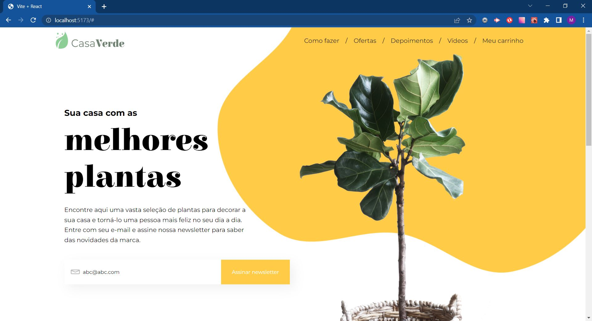

# Alura Challenge - 7 Days of Code React

## Dias

### 01/07:

Escreva o componente do menu da aplicação e o componente de assinatura da newsletter. Os dois são compostos de outras partes e, para que o seu código não fique bagunçado, minha sugestão é: separe a aplicação em mais de dois componentes. Crie as separações de contextos e componentes.

### 02/07:

Pegue os componentes que você criou e, em vez de ter um arquivo .css para cada um, transforme o CSS em styled components.

### Screenshot

### 03/07:

Hoje você vai trabalhar com algumas novidades e adicionar funcionalidades à sua aplicação.
Atualmente, já é um padrão em projetos React a utilização dos hooks. Entre eles, o useState é o mais comum.
Adicione funcionalidades ao formulário de cadastro de e-mail para a newsletter.
O seu dever é garantir que a pessoa coloque um e-mail válido antes de liberar o botão de cadastro.
Quando houver um e-mail válido preenchido e o usuário clicar em Assinar Newsletter, um alerta deverá aparecer na tela com a seguinte mensagem:
"Obrigado pela sua assinatura, você receberá nossas novidades no e-mail [e-mail cadastrado]".
